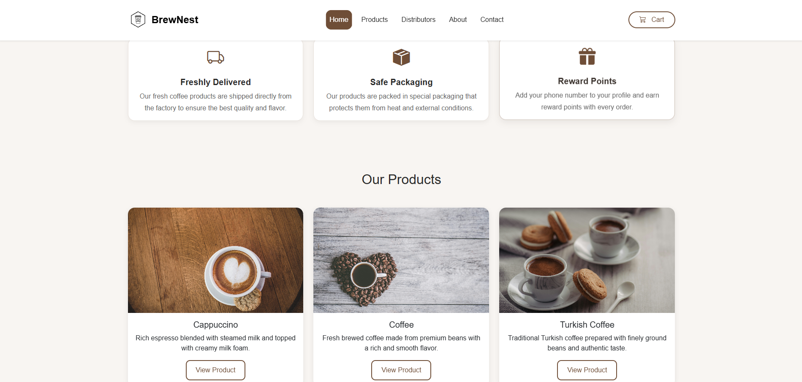
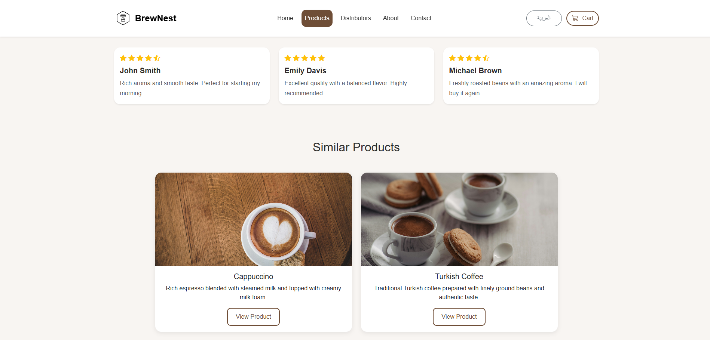
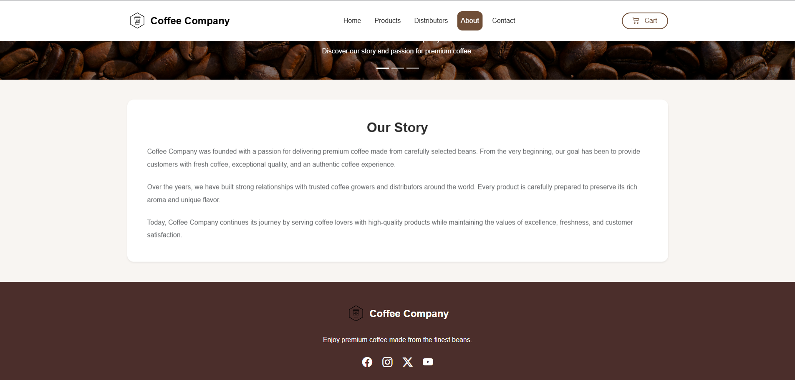
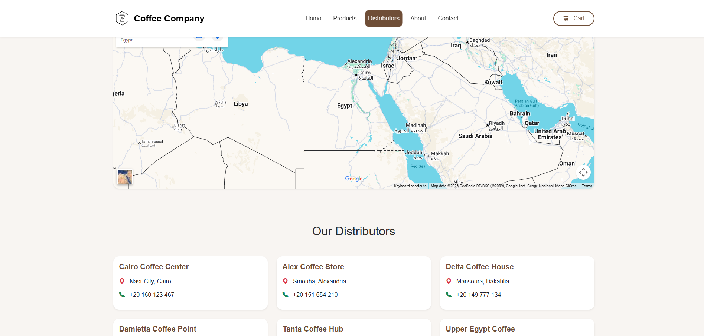
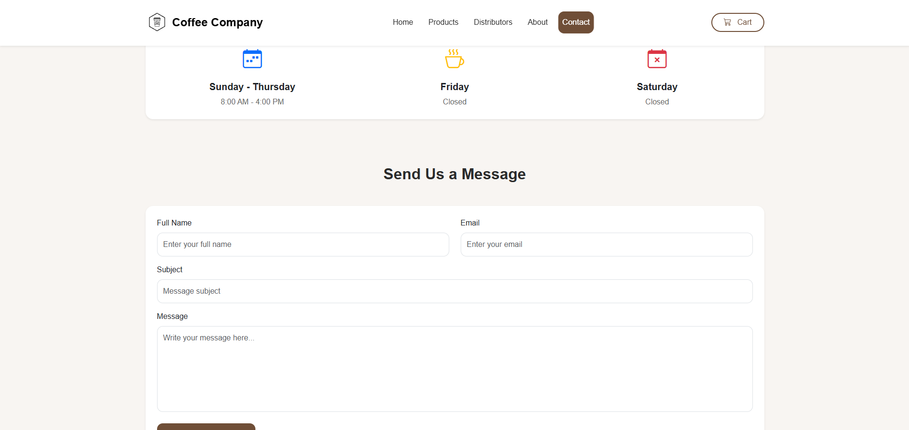

# ☕ Coffee Company Website

A modern, responsive coffee company website built with **HTML5**, **SCSS (Sass)**, **Bootstrap 5**, and **JavaScript (ES6)**. The project showcases a complete multi-page coffee shop website with responsive layouts, product pages, customer reviews, distributors, Google Maps integration, and form validation.

---

# 🚀 Live Demo

https://your-demo-link.vercel.app

---

# 📂 GitHub Repository

https://github.com/your-username/coffee-company

---

# 📸 Screenshots

## 🏠 Home



---

## ☕ Product Page



---

## 📖 About



---

## 🌍 Distributors



---

## 📞 Contact



---

# ✨ Features

- Fully Responsive Design
- Modern Bootstrap 5 UI
- Hero Carousel
- Services Section
- Products Section
- Individual Product Pages
- Product Information
- Customer Reviews
- Similar Products
- About Company Page
- Distributors Page
- Google Maps Integration
- Working Hours Section
- Contact Form Validation
- Newsletter Validation
- Reusable Components
- Organized SCSS Architecture

---

# 🛠️ Built With

- HTML5
- SCSS (Sass)
- Bootstrap 5
- JavaScript (ES6)
- Bootstrap Icons
- Vite
- Git
- GitHub

---

# 📁 Project Structure

```text
coffee-company
│
├── screenshots
│   ├── home.png
│   ├── product.png
│   ├── about.png
│   ├── distributors.png
│   └── contact.png
│
├── src
│   ├── assets
│   │   ├── images
│   │   └── icons
│   │
│   ├── js
│   │   ├── main.js
│   │   ├── contact.js
│   │   └── footer.js
│   │
│   └── scss
│       ├── _variables.scss
│       ├── _global.scss
│       ├── _navbar.scss
│       ├── _hero.scss
│       ├── _products.scss
│       ├── _product.scss
│       ├── _about.scss
│       ├── _distributors.scss
│       ├── _contact.scss
│       ├── _footer.scss
│       ├── _responsive.scss
│       └── style.scss
│
├── index.html
├── about.html
├── distributors.html
├── contact.html
├── cappuccino.html
├── coffee.html
├── turkish-coffee.html
├── package.json
└── README.md
```

---

# 📄 Pages

- 🏠 Home
- ☕ Cappuccino
- ☕ Coffee
- ☕ Turkish Coffee
- 📖 About
- 🌍 Distributors
- 📞 Contact

---

# 📱 Responsive Design

The website is fully responsive and optimized for:

- Desktop
- Laptop
- Tablet
- Mobile

---

# ✅ Form Validation

### Contact Form

- Full Name Validation
- Email Validation
- Subject Validation
- Message Validation
- Bootstrap Validation States

### Newsletter

- Email Validation
- Bootstrap Validation States

---

# 🗺️ Google Maps

- Company Location
- Distributors Locations

---

# 🎯 Learning Objectives

This project was built to practice:

- Responsive Web Design
- Bootstrap Components
- SCSS Architecture
- JavaScript DOM Manipulation
- Form Validation
- Multi-page Website Development
- Git Workflow
- Clean Code Organization

---

# 👨‍💻 Author

**Ibrahim Elmahdy**

- GitHub: https://github.com/your-username
- LinkedIn: https://linkedin.com/in/your-profile

---

# 📜 License

This project was created for educational purposes only.
